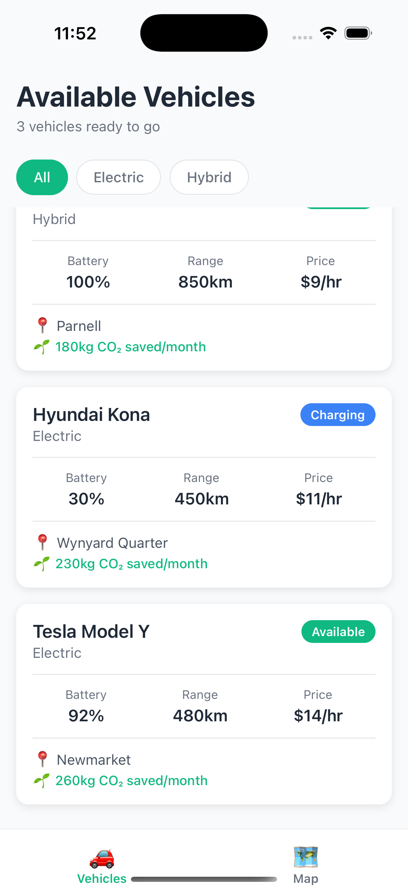
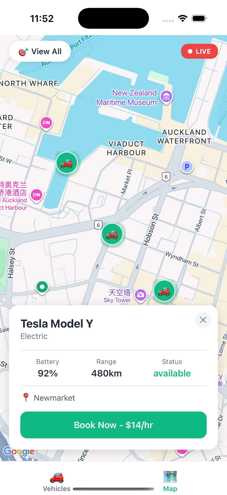

# Carbn Demo - Vehicle Tracking & Booking

A React Native demo built for Carbn's Front-end Developer position, showcasing real-time vehicle tracking and booking features.

## Tech Stack

- React Native (Expo Router)
- JavaScript (TypeScript-ready for production)
- Zustand (State Management)
- React Native Maps
- Expo Location

## Features

**Vehicle List**

- Browse electric and hybrid vehicles
- Filter by vehicle type
- Real-time status updates (Available/In Use/Charging)
- Battery level, range, and pricing info

**Interactive Map**

- Live vehicle location tracking
- Color-coded status markers
- Real-time position updates (every 3 seconds)
- Vehicle detail cards on marker tap

**Real-Time Simulation**

- Simulates WebSocket behavior with setInterval
- Vehicles in use move ~200m every 3 seconds
- Battery drain for active vehicles

## Screenshots

### Vehicle List



### Map View



## Installation

```bash
# Install dependencies
npm install

# Start development server
npx expo start

# Run on iOS (press 'i') or Android (press 'a')
```

## Project Structure

```
app/
├── _layout.jsx              # Tab navigation
├── index.jsx               # Vehicle list screen
├── map.jsx                 # Map screen
├── components/
│   ├── VehicleCard.jsx
│   └── VehicleMarker.jsx
├── store/
│   └── VehicleStore.jsx    # Zustand store
└── data/
    └── MockVehicles.js
```

## Key Decisions

**JavaScript vs TypeScript**: Used JavaScript for rapid prototyping. Production code would use TypeScript for type safety.

**Zustand**: Chose Zustand over Redux for minimal boilerplate and better performance.

**Real-Time Simulation**: Used setInterval to mimic WebSocket updates. Production would use actual WebSocket connections.

## What This Demonstrates

- 0-to-1 product development
- Real-time data synchronization patterns
- Clean, scalable architecture
- Mobile-first UI/UX design
- Efficient state management

---

_Built for Carbn's Front-end Developer application_
